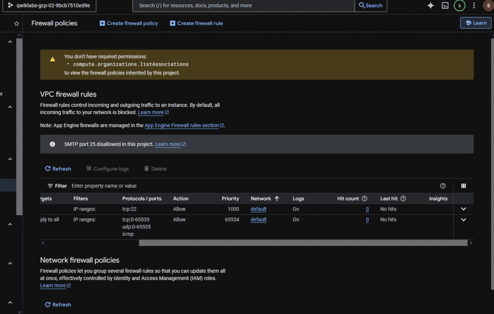
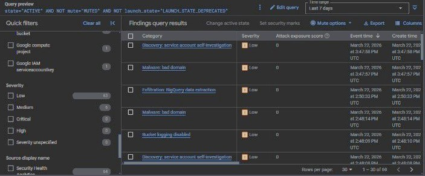
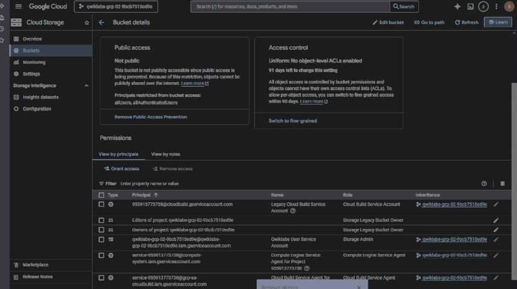

# Google Cloud Security: Data Breach Response & Remediation

## 📌 Project Overview
Este projeto documenta o processo de resposta a incidentes e o endurecimento de infraestrutura (hardening) realizado para a Cymbal Retail durante uma simulação de violação de dados. O objetivo central foi remediar vulnerabilidades de severidade crítica e atingir 100% de conformidade com os padrões PCI DSS 3.2.1.

🛡️ Technical Implementation
1. Incident Response (NIST Framework)
A fase de resposta focou-se na contenção imediata e análise forense de artefactos comprometidos.

* **Detecção:** Identificação de exfiltração de dados no BigQuery via Security Command Center.
    
* **Contenção:** Restrição de acesso SSH via Identity-Aware Proxy (IAP) e encerramento de instâncias comprometidas.
* **Erradicação:** Remoção de VMs infectadas com malware e eliminação de regras de firewall "allow-all".
* **Recuperação:** Restauração de serviços críticos utilizando snapshots de Compute Engine com Secure Boot ativado.

2. Infrastructure Hardening
Implementação de controlos de segurança preventivos para reduzir a superfície de ataque.

* **VPC Firewall Logging:** Configuração de regras de firewall restritivas e ativação de logs de fluxo para detecção de movimentos laterais na rede.
    
* **Cloud Storage Security:** Conversão de buckets para Uniform Access Control e revogação de todas as permissões públicas (allUsers), assegurando a privacidade dos dados sensíveis.
    
* **Identity-Aware Proxy (IAP):** Eliminação de dependências de IPs públicos para acessos administrativos.

3. Compliance & Monitoring
Utilização do Security Command Center (SCC) como ferramenta central de governação.

* **Mitigação de Riscos:** Correção de portas SSH/RDP abertas, ACLs de buckets públicos e comunicações de malware detectadas em tempo real.
* **Resultado:** Validação final de conformidade através de dashboards de segurança e auditoria de recursos.

🛠️ Tools Used
* **Cloud Provider:** Google Cloud Platform (GCP)
* **Security Tools:** Security Command Center (SCC), Firewall Policies, Cloud IAM, IAP.
* **Compute/Storage:** Compute Engine (Snapshots), Cloud Storage (Hardening), BigQuery.
